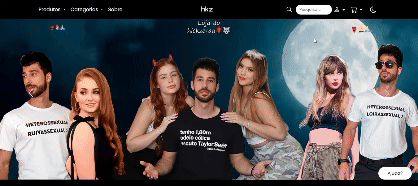

# Projeto: Remake de site/app web

[Acesse o site publicado](https://elc1090.github.io/project1-2025a-pedro-henrique-jv/)

## Desenvolvedor(a)
**Nome:** Pedro H. Jovanowichs  
**Curso:** Sistemas de Informação

## Cliente
**Nome:** Rodrigo Appelt

## Site/app original

### Link
[Site original](https://reserva.ink/hickzeraa)

### Descrição
O site oferece uma variedade de vestuário, incluindo camisetas, regatas, moletons e camisetas oversized, com estampas e frases bem-humoradas. Possui uma interface organizada, facilitando a navegação e, ao mesmo tempo, chamativa. O código, apesar de extenso e complexo, é bem organizado.

## Demanda do(a) Cliente
Gostaria que tivesse uma página para cada produto, botão que troca entre modo escuro e claro, barra de pesquisa entre as páginas cadastradas e um banner animado no topo com mensagens promocionais e/ou anúncios. 

## Desenvolvimento
O remake foi desenvolvido com o objetivo de manter a aparência o mais fiel possível ao original. No entanto, algumas diferenças foram introduzidas devido a escolhas de design e às demandas do cliente. O trabalho foi realizado de forma incremental, desenvolvendo um elemento da página por vez. As demandas foram implementadas conforme o grau de dificuldade e a parte da página em desenvolvimento.

## Tecnologias
- **HTML5** para a estrutura da página.
- **CSS3 com Bootstrap** para estilização.
- **JavaScript** para funcionalidades interativas.

## Ambiente de Desenvolvimento
- **Editor:** VS Code
- **Extensão:** Live Server

## Referências e Créditos
- **Bootstrap:** [Documentação](https://getbootstrap.com/docs/5.0/getting-started/introduction/)
- **Bootstrap Icons:** [Ícones](https://icons.getbootstrap.com/)
- **ChatGPT:** Usado para gerar o script que alterna entre os modos light e dark ([ChatGPT](https://chatgpt.com/))

Projeto entregue para a disciplina de [Desenvolvimento de Software para a Web](http://github.com/andreainfufsm/elc1090-2025a) no semestre 2025a.

